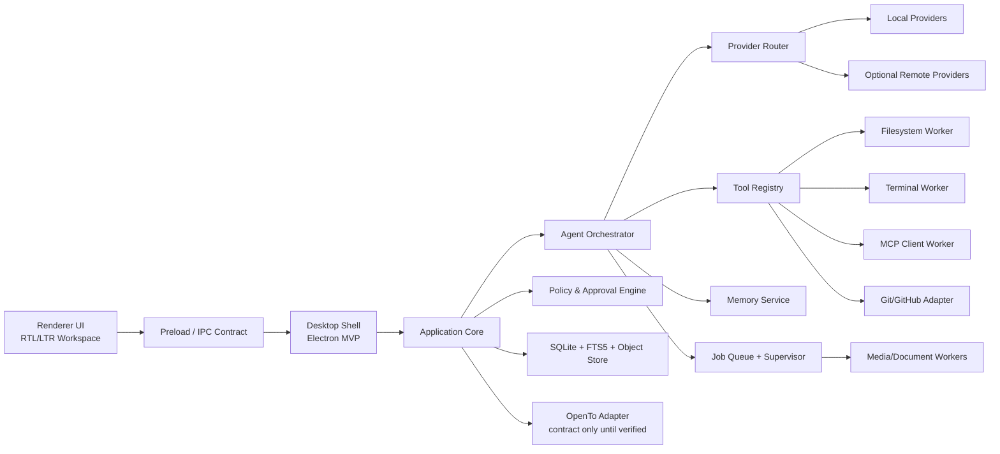
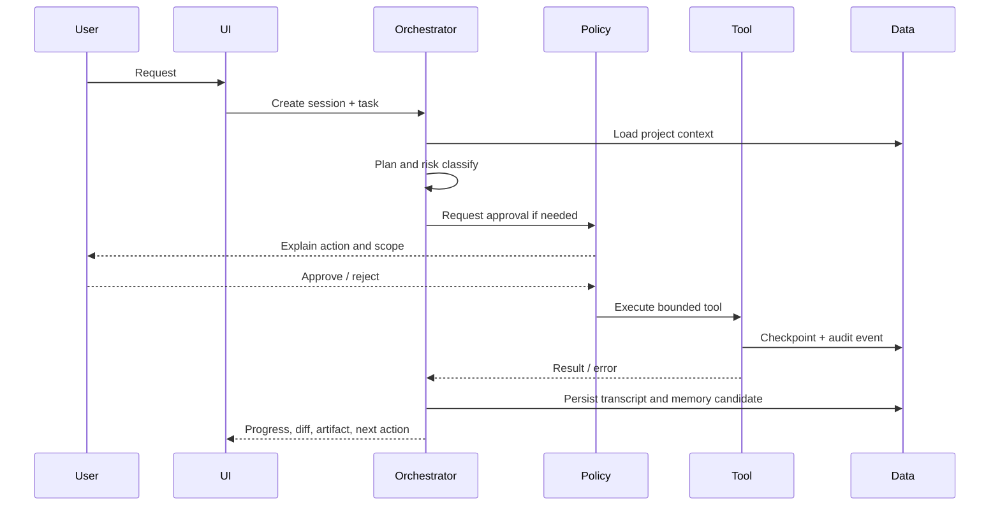

# المعمارية العليا

## القرار

المعمارية المختارة هي **Modular Desktop Monolith مع Process Isolation**. يوجد desktop shell، وواجهة renderer، وapplication core، وagent runtime، وprovider gateway، وdata layer، وworkers. الوحدات تتشارك contracts لا استيرادات عشوائية. أي مكون عالي المخاطر أو ثقيل يمكن تشغيله خارج العملية الرئيسية.

هذا القرار يستفيد من فصل OpenCode بين core وdesktop وحزم SDK [1]، ومن طبقات Hermes التي تجعل agent loop وtool registry وsession storage وgateway حدودًا واضحة [2]، ومن مبدأ capability seams في DeepSeek Harness [3].

## المخطط

## حدود العملية

تعمل الواجهة في renderer غير موثوق نسبيًا ولا تملك filesystem أو secrets. يعمل main process كـ broker محدود. يعمل agent runtime في worker/process مستقل كي لا يؤدي loop أو model client إلى تجميد الواجهة. تعمل أدوات shell وbrowser وdocument conversion بحدود منفصلة، مع working directory وenvironment وtimeout خاص بكل job. لا تُمنح MCP servers صلاحية عامة؛ كل server يمر عبر catalog وconsent وscope.

## دورة المهمة

## العقود الداخلية

العقود الأساسية هي `AgentSession`, `Task`, `ToolManifest`, `PermissionGrant`, `ProviderCapability`, `MemoryItem`, `Artifact`, `Job`, و`AuditEvent`. كل عقد يحمل `schema_version` و`created_at` و`correlation_id`. لا يعبر أي JSON من worker إلى UI دون validation؛ ويجب أن تكون نتائج الأدوات data-only حتى لا تتحول نصوص tool إلى تعليمات للوكيل.

## OpenTo

يُعرّف `OpenToAdapter` عمليات `detect()`, `getCapabilities()`, `openProject()`, `sendCommand()`, و`subscribeEvents()`، لكن implementation الافتراضي يعيد `NOT_CONFIGURED`. لا يجوز بناء IPC أو plugin خاص بـ OpenTo على التخمين. عند وصول مواصفة رسمية، يُضاف contract test يثبت الإصدار والمنصة ونموذج الصلاحيات.

## لماذا لا microservices الآن؟

microservices ستضيف deployment وservice discovery وauth وversioning قبل وجود مستخدمين أو حمل متعدد الأجهزة. process isolation يحقق عزلًا كافيًا لسطح المكتب، ويمكن استخراج worker إلى خدمة لاحقًا إذا ظهرت حاجة. النواة تبقى modular monolith لتقليل التكلفة المعرفية.

## References / المراجع

[1]: https://github.com/anomalyco/opencode "OpenCode repository"
[2]: https://github.com/NousResearch/hermes-agent "Hermes Agent repository"
[3]: https://github.com/deepseek-ai/deepseek-harness "DeepSeek Harness repository"

إعداد: Manus AI. تاريخ الفحص: 2026-08-21.
