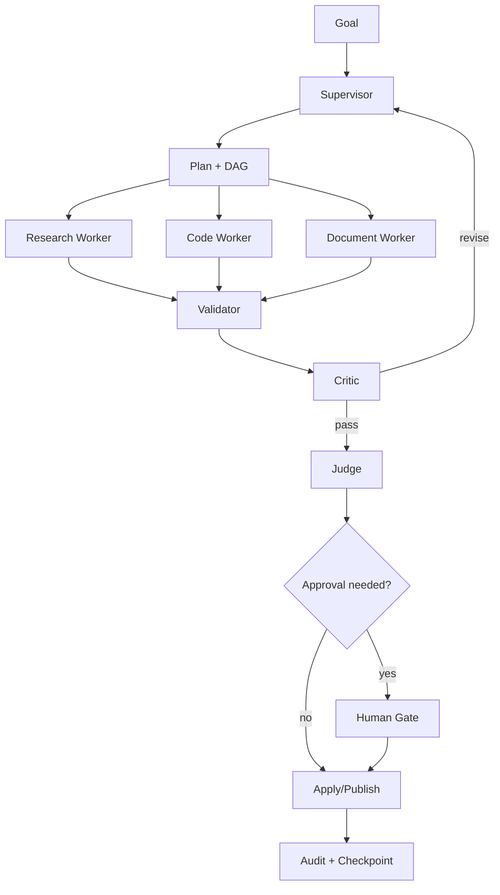

# معمارية الوكلاء

## المبدأ

الوكيل ليس شخصية محادثة فقط؛ هو مكوّن ينفذ حلقات تخطيط واستدعاء أدوات وتحقق. لذلك يجب الفصل بين **agent definition** و**agent runtime** و**tool permissions** و**memory scope**. لا تُنشأ 70 عملية دائمة؛ تُسجل حتى 70 تعريفًا متخصصًا ويُشغّل عدد محدود وفق الموارد والاعتماديات.

## الهيكل التنظيمي

| الطبقة | المسؤولية | الحد |
|---|---|---|
| General Manager | ترتيب أهداف مساحة العمل وتصعيد التعارضات | لا يشغل shell مباشرة |
| Project Manager | تفكيك المشروع إلى milestones وdependencies | لا يكتب ملفات دون worker معتمد |
| Planner | بناء الخطة والافتراضات ومعايير القبول | ناتج قابل للتحرير |
| Specialist | بحث، كود، مستند، صوت، بيانات، UX، أمن | صلاحيات تخصصية محدودة |
| Worker | تنفيذ خطوة صغيرة ومحددة | context معزول وtimeout |
| Critic | كشف الثغرات والادعاءات غير المثبتة | لا يطبق التعديل بنفسه |
| Judge | تقييم الناتج مقابل acceptance criteria | قرار pass/fail مع دليل |
| Human Gate | اعتماد الأفعال عالية المخاطر | لا يختزل إلى prompt hidden |

## نمط التنسيق

التنسيق المختار **hierarchical supervisor + DAG task graph + isolated workers**. يخطط supervisor، وتتحول الخطة إلى عقد DAG، ثم توزع على workers المستقلين. تعاد النتائج إلى validator، ويحدد critic إعادة المحاولة أو الفشل. peer-to-peer مفتوح فقط داخل workflow موثق؛ لا يسمح لوكيل بإنشاء حلقة تفويض غير محدودة.

## الرسائل والسياق

كل task يملك `task_context` مستقلًا مع روابط إلى project context وshared artifacts. لا يُنسخ transcript كامل إلى كل worker؛ يمرر supervisor context packet يتضمن الهدف، القيود، الملفات ذات الصلة، النتائج السابقة، وميزانية tokens. النتائج الكبيرة تحفظ كـ artifact ويُرسل hash/summary فقط. هذا ينسجم مع فصل Hermes للسياق والضغط والـ auxiliary tasks [1].

## التحقق والجودة

يجب أن يخرج كل worker بـ `result`, `evidence`, `assumptions`, `changed_files`, و`next_recommendation`. لا يقبل judge ناتجًا بلا evidence. في الكود، evidence هو diff وtest output. في البحث، evidence هو source record. في الإنتاج، evidence هو artifact metadata وrender check. Separate critic/judge مفيد عندما تكون تكلفة الخطأ عالية، لكنه يرفع التكلفة؛ لذلك يفعّل حسب risk score.

## التعارض والتراجع

عند تعارض نتائج عاملين، لا يدمج النظام تلقائيًا. ينشئ `Conflict` يحدد الموارد المتعارضة، الأولوية، source of truth، وقرارًا مطلوبًا من supervisor أو المستخدم. قبل كل write/commit/publish ينشئ checkpoint. كل retry يحمل idempotency key. الإلغاء يوقف المهمة ويترك الحالة `CANCELLED_WITH_RECOVERY` إذا تعذر التراجع الكامل.

## حدود الاستقلال

`manual` لا يشغل أفعالًا خارجية دون طلب مباشر. `assisted` يخطط ويقترح وينفذ منخفض الخطورة فقط، ويطلب approval للباقي. `autonomous` لا يفعل إلا workflows allowlisted بحد زمني ومالي ومعدل، مع توقف تلقائي عند فشل متكرر أو تغير السياق.

## References / المراجع

[1]: https://github.com/NousResearch/hermes-agent/blob/main/website/docs/developer-guide/architecture.md "Hermes architecture"
[2]: https://github.com/deepseek-ai/deepseek-harness/blob/master/docs/architecture.md "DeepSeek Harness architecture"

إعداد: Manus AI. تاريخ الفحص: 2026-08-21.
