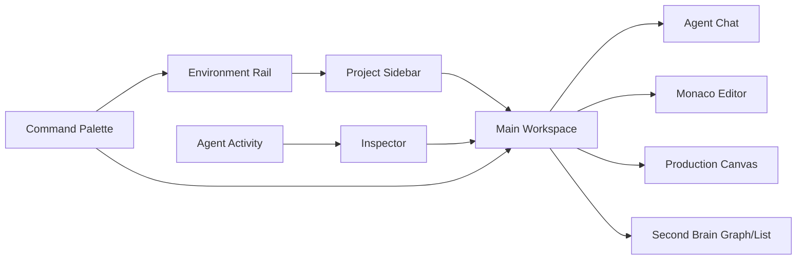

# معمارية الواجهة الأمامية

## القرار

تُبنى الواجهة كمجموعة shell وworkspace panels وfeature routes. يفضل React أو SolidJS وفق الفريق، لكن لا يثبت القرار النهائي قبل prototype؛ OpenCode يستخدم SolidJS ضمن monorepo وDesktop shell [1]، بينما Hermes Desktop يستخدم React مع Electron وxterm وCodeMirror [2]. التوصية العملية لـ MVP هي React + TypeScript إن كان الفريق يريد ecosystem أوسع، أو SolidJS إذا كان الهدف الاقتراب من أنماط OpenCode؛ كلاهما يجب أن يستهلك contracts مستقلة.

## المعلوماتية

الهيكل الأساسي هو: **Global rail** للبيئات، **Project sidebar** للملفات والمهام والذاكرة، **Main workspace** للمحرر/المحادثة/العرض، **Inspector** للسياق والصلاحيات والنشاط، و**Command palette** للبحث والأوامر. لا تُدفن approval داخل chat؛ تظهر كبطاقة مستقلة مع scope وسبب ومدة.

## الحالة

تُقسم الحالة إلى UI state، session state، server/core state، وcache. لا تحفظ الأسرار أو نصوص prompt النهائية في global store. يستخدم كل request `correlation_id`, ويقبل frontend أحداثًا versioned. التحديثات المتدفقة لا تعيد رسم شجرة كبيرة؛ تستخدم append-only event list وvirtualization.

## المكونات الحرجة

المكونات الأساسية هي `WorkspaceShell`, `EnvironmentRail`, `ProjectTree`, `SessionTabs`, `AgentComposer`, `PlanView`, `ApprovalCard`, `DiffViewer`, `TerminalPanel`, `ActivityTimeline`, `ProviderStatus`, `MemorySearch`, و`ArtifactViewer`. يجب أن تقبل المكونات `dir`, `locale`, `density`, `risk_state` و`loading/error/empty` states.

## RTL/LTR والعربية

تستخدم CSS logical properties، و`dir="rtl"` على مستوى app، و`dir="ltr"` للكود وterminal وعناوين الملفات عند الحاجة. تبقى الأيقونات التي تحمل معنى اتجاهي معكوسة وفق semantic direction لا وفق transform أعمى. يستخدم المشروع خط واجهة عربي/لاتيني مرخصًا بوضوح مع fallback، ولا يضمّن ملف font غير موثق. النصوص في i18n resources، وتُختبر السلاسل الطويلة والمختلطة عربي/إنجليزي.

## الأداء وإمكانية الوصول

تستخدم القوائم virtualization، وتُحمّل Monaco وcharts وmedia viewers عند الحاجة. كل action أساسي keyboard-accessible، وللعناصر التفاعلية label وfocus ring وحالة disabled. يجب أن تعرض الواجهة ما يفعله الوكيل الآن وما ينتظره من المستخدم، لا مجرد spinner.

## References / المراجع

[1]: https://github.com/anomalyco/opencode/blob/dev/packages/desktop/package.json "OpenCode desktop manifest"
[2]: https://github.com/NousResearch/hermes-agent/blob/main/apps/desktop/package.json "Hermes desktop manifest"

إعداد: Manus AI. تاريخ الفحص: 2026-08-21.
