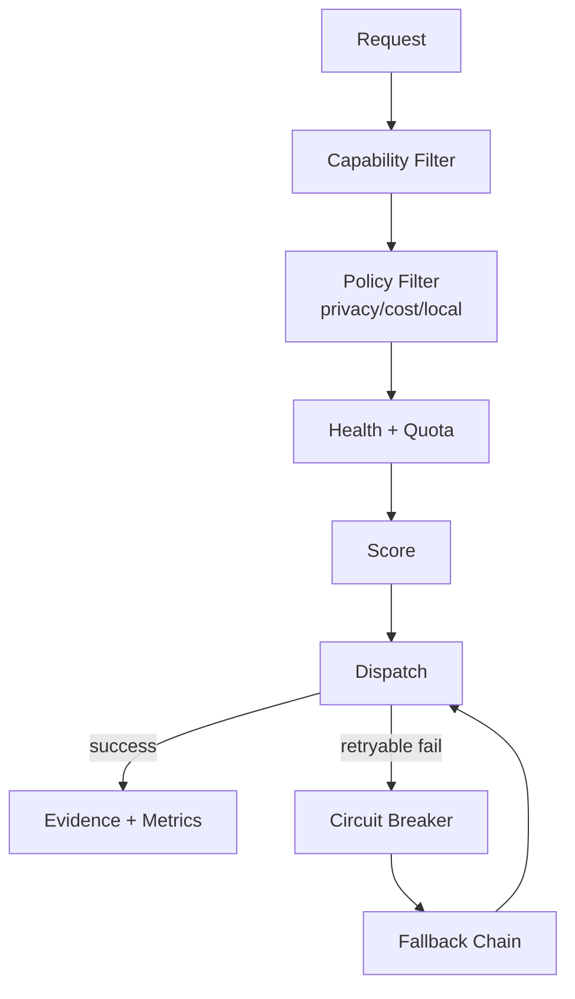

# توجيه المزوّدات والنماذج

## العقد

كل provider يعلن `ProviderManifest` يحتوي `id`, `protocol`, `base_url`, `auth_kind`, `capabilities`, `models`, `regions`, `cost_policy`, `privacy_policy`, `health_policy`, و`license_notes`. كل model يعلن context window، modalities، tool calling، structured output، streaming، estimated latency، وlocal/offline flag.

## القرار

التوجيه **free-first + local-first + capability-aware**، لكن لا يختار «المجاني» إذا كان غير آمن أو غير متاح أو لا يحقق capability. OmniRoute يثبت نمط provider registry وquota-aware auto-fallback [1]، ويستخدم المشروع هذه الفكرة داخل contract مستقل لا عبر نسخ router كامل.

## score

يحسِب النظام score من الجودة المتوقعة، latency، reliability، privacy fit، cost، local preference، وquota headroom. الأوزان قابلة للتكوين وليست hidden. في offline mode يُستبعد provider الشبكي قبل score. في tasks الحساسة، privacy وapproval أعلى من السعر.

## failure policy

الخطأ المصنف auth/billing/invalid request لا يعاد تلقائيًا. timeout/5xx/quota exhaustion قد يمر إلى fallback إن كان task idempotent. لكل provider cooldown وcircuit breaker، مع half-open probe. لا يكرر browser submit أو GitHub push دون idempotency key. تظهر للمستخدم provider/model الذي خدم الطلب مع سبب التحويل.

## caching

يستخدم cache للـ embeddings والنتائج deterministic والـ prompt prefixes مع content hash وpolicy. لا يُخزن رد يحتوي بيانات حساسة في cache مشترك. semantic cache يحتاج evaluation حتى لا يعيد ردًا قديمًا في task متغير.

## مصفوفة capability

| capability | local default | optional remote | fallback |
|---|---|---|---|
| LLM text/tool | Ollama أو llama.cpp | OpenAI-compatible/Anthropic/Gemini | local small model أو queued |
| embeddings | local sentence-transformers/llama.cpp | provider embeddings | FTS5 |
| STT | faster-whisper | remote STT | manual transcript |
| TTS | Piper | remote TTS | text-only |
| image | ComfyUI worker | remote image | template/placeholder |
| video | FFmpeg editing | remote generation | queued/disabled |
| search | local index/SearXNG self-hosted | remote search | no-network mode |
| OCR | Tesseract/PDF text | remote OCR | manual review |

## الرصد

تسجل metrics `request_count`, `success_rate`, `p50/p95_latency`, `time_to_first_token`, `input/output_tokens`, `estimated_cost`, `quota_remaining`, `fallback_count`, و`circuit_state`. لا تجمع prompts كاملة في telemetry افتراضيًا.

## References / المراجع

[1]: https://github.com/diegosouzapw/OmniRoute "OmniRoute repository"
[2]: https://github.com/ollama/ollama "Ollama repository"
[3]: https://github.com/ggml-org/llama.cpp "llama.cpp repository"
[4]: https://github.com/SYSTRAN/faster-whisper "faster-whisper repository"

إعداد: Manus AI. تاريخ الفحص: 2026-08-21.
