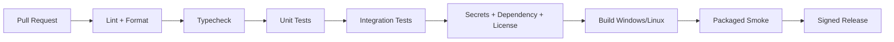

# DevOps وCI/CD

## السياسة

يستخدم المشروع trunk-based أو short-lived branches مع commits صغيرة وPRs موثقة. لا تُدمج ميزة عالية الخطورة دون contract tests وsecurity review وlicense impact. تثبت الإصدارات في lockfiles، ويولد CI SBOM وchecksums.

## pipeline

## البناء

يُبنى renderer وcore وworkers ثم يعبأ Electron. تُبنى native dependencies لكل target. يستفيد المشروع من أن OpenCode وHermes لديهما Electron-builder workflows وتحديد artifacts للأنظمة [1] [2]. لا تستخدم artifact غير موقع في production. macOS يظل Tier 2 حتى تتوفر signing/notarization credentials.

## الاختبارات

تغطي الاختبارات contracts، migrations، path policy، shell approval، provider failover، memory deletion، MCP consent، export، RTL، وpackage smoke. يضاف mutation testing للأجزاء policy، ولا يكتفى بـ snapshot للواجهة.

## الإصدارات

كل release يحمل version، git SHA، schema version، dependency manifest، SBOM، checksums، وnotes. التحديث يتحقق من channel وsignature وminimum schema. rollback يعيد artifact السابق ولا يمس بيانات المستخدم دون migration backup.

## المراقبة

في local-first يكون telemetry opt-in. logs محلية structured، وdiagnostics export يدوي redacted. لا يرسل النظام prompts أو الملفات افتراضيًا. يمكن لاحقًا إضافة OpenTelemetry في وضع self-hosted مع endpoint يحدده المستخدم.

## سلسلة التوريد

تشغل CI Gitleaks وTrivy وOpenSSF Scorecard، وتفحص npm/pip/cargo lockfiles. أي `postinstall` أو native build يراجع قبل الاعتماد. تحفظ THIRD_PARTY_NOTICES محدثة. إصدارات المكونات المرجعية المثبتة وقت البحث تحفظ في `project/open-source-components.json`.

## References / المراجع

[1]: https://github.com/anomalyco/opencode/blob/dev/packages/desktop/package.json "OpenCode desktop packaging"
[2]: https://github.com/NousResearch/hermes-agent/blob/main/apps/desktop/package.json "Hermes desktop packaging"
[3]: https://github.com/gitleaks/gitleaks "Gitleaks"
[4]: https://github.com/aquasecurity/trivy "Trivy"
[5]: https://github.com/ossf/scorecard "OpenSSF Scorecard"

إعداد: Manus AI. تاريخ الفحص: 2026-08-21.
