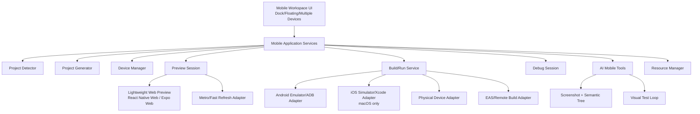

# معمارية تطوير الهاتف والمعاينة المحمولة

## القرار التنفيذي

يُبنى subsystem الهاتف على **مسارين متوازيين** داخل bounded context واحد:

1. **Lightweight Preview:** معاينة سريعة داخل Osamah عبر WebView/renderer مع React Native Web أو Expo Web-compatible bundle، وإطار جهاز وprofile وتفاعل ولقطات. هذا المسار مفيد على Windows/Linux/macOS ولا يدّعي native fidelity.
2. **Native Runtime Adapters:** تكامل مع Metro وdevelopment builds وAndroid Emulator/ADB وiOS Simulator/Xcode على macOS والأجهزة الفعلية وEAS/remote builds. هذا المسار مطلوب للتحقق من native modules وplatform behavior ولا يُشغّل داخل UI process.

React Native Web طبقة توافق بين React DOM وReact Native، وSnack يثبت فصل editor/bundler/runtime/device transport [1] [2]. Expo يثبت أن development builds تسمح بتغيير native configuration، بينما Fast Refresh وMetro نقطة التكامل الرسمية للتحديث السريع [3] [4] [5].

## طبقات subsystem

## Device Manager

`DeviceProfile` يملك `id`, `platform`, `osVersion`, `width`, `height`, `dpi`, `safeArea`, `statusBar`, `navigation`, `orientation`, `theme`, و`capabilities`. MVP ينفذ geometry/theme/orientation؛ camera/microphone/GPS/sensors/battery/network حالات mock قابلة للإضافة عبر capability modules. لا يخزن profile كحقيقة عن hardware native؛ profile للمعاينة قابل للتعديل.

## التفاعل

في Lightweight Preview، tap/long press/swipe/scroll/drag/keyboard/copy-paste تعبر DOM/pointer/keyboard events مع transform من device coordinates إلى CSS viewport، بينما rotate/zoom تغيّر profile/container. screenshot يؤخذ من WebView/renderer مع metadata. في Android/iOS الحقيقي، تمر التفاعلات عبر ADB/Xcode/physical-device tooling عندما يدعمها adapter؛ لا يحاول Osamah محاكاة hardware input في preview.

## Metro وFast Refresh

`MetroProcessAdapter` يشغل Metro في worker process، يراقب stdout/stderr/port/health، ويحوّل refresh events إلى `PreviewEvent`. Fast Refresh يظل سريعًا للمكونات التي يمكن تحديثها، لكنه قد يتحول إلى full reload عند exports أو native changes [3]. Native dependency change ينتقل إلى `REQUIRES_NATIVE_REBUILD` بدل loop غير محدود.

## المنصات

| البيئة | Lightweight Preview | Android native | iOS native | remote/physical |
|---|---|---|---|---|
| Windows | نعم | نعم عند SDK/AVD/acceleration | لا؛ يظهر غير متاح | EAS/remote أو جهاز فعلي |
| Linux | نعم | نعم عند SDK/AVD/acceleration | لا؛ يظهر غير متاح | remote أو جهاز فعلي |
| macOS | نعم | نعم | نعم عبر Xcode/Simulator | EAS/physical |
| CI Linux | headless screenshot ممكن | emulator headless عند hardware/runner مناسب | لا native simulator | EAS/remote |
| CI macOS | نعم | ممكن | ممكن عند Xcode/signing | EAS/physical حسب secrets |

iOS Simulator متاح ضمن macOS/Xcode وفق Apple [6]. Android Emulator يعتمد على graphics/VM acceleration ويحتاج كشفًا وإدارة موارد [7]. EAS يمكن أن يبني iOS من أنظمة مختلفة، لكنه لا يساوي local Simulator ولا تفاعلًا native لحظيًا [8].

## مقارنة البدائل

| البديل | fidelity | CPU/RAM/GPU | Windows | macOS | الاستخدام |
|---|---|---|---|---|---|
| Android Emulator | native عالية | عالية | نعم | نعم | native verification |
| Apple Simulator | native عالية | عالية | لا | نعم | iOS verification |
| React Native Web/Expo Web | جزئية | منخفضة-متوسطة | نعم | نعم | MVP preview |
| browser-metro/Web Worker | JS/DOM جزئية | منخفضة في host؛ network/cache | نعم | نعم | instant preview |
| custom canvas renderer | منخفضة إلا للـ visual subset | منخفضة | نعم | نعم | لا يوصى به كـ RN runtime |
| remote device/build | native حسب الخدمة | محلية منخفضة، network عالية | نعم | نعم | fallback/CI |
| physical device | native حقيقية | محلية منخفضة، setup أعلى | نعم/ macOS حسب device | نعم | final validation |

## قرار MVP

يبدأ التنفيذ بـ `DeviceProfile`, `PreviewSession`, `LightweightPreviewAdapter` contract، project detector، وواجهة dock قابلة للمحاكاة دون تشغيل Android Emulator. بعد ذلك يضاف Metro/Fast Refresh adapter. Android adapter يأتي بعد `doctor` وresource manager، وiOS adapter يبقى macOS-only. لا يعلن النظام native support بناءً على نجاح preview فقط.

## References

[1]: https://necolas.github.io/react-native-web/docs/ "React Native for Web"
[2]: https://github.com/expo/snack "Expo Snack repository"
[3]: https://reactnative.dev/docs/fast-refresh "Fast Refresh"
[4]: https://docs.expo.dev/guides/why-metro/ "Why Metro?"
[5]: https://docs.expo.dev/develop/development-builds/introduction/ "Development builds"
[6]: https://developer.apple.com/documentation/safari-developer-tools/installing-xcode-and-simulators "Installing Xcode and Simulators"
[7]: https://developer.android.com/studio/run/emulator-acceleration "Android Emulator hardware acceleration"
[8]: https://docs.expo.dev/develop/development-builds/introduction/ "Expo build options"

إعداد: Manus AI. تاريخ الفحص: 2026-08-22.
