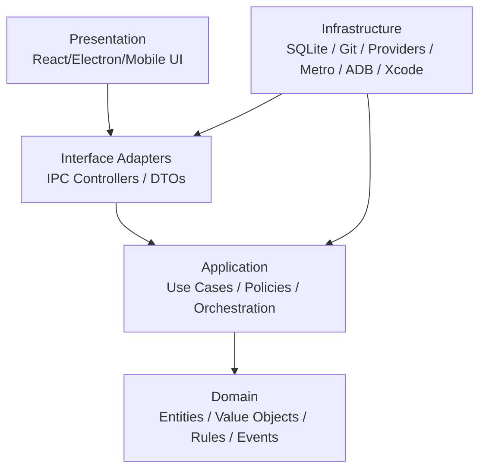

# Clean Architecture وBounded Contexts

## القاعدة

الـ Domain لا يعتمد على React أو Electron/Tauri أو OpenCode أو Hermes أو OmniRoute أو database أو provider أو filesystem أو OS APIs. الـ Application يعتمد على domain ports، وInterface Adapters تحول input/output، وInfrastructure تنفذ ports، وPresentation تتعامل مع UI/IPC. الاتجاه دائمًا من الخارج إلى الداخل، ولا يسمح core باستيراد infrastructure.



## الطبقات

| الطبقة | تملك | لا تعتمد على |
|---|---|---|
| Domain | entities، value objects، invariants، domain events، pure policies | UI، DB، OS، vendor |
| Application | use cases، ports، orchestration، transaction boundaries | concrete adapter |
| Interface Adapters | controllers، presenters، DTO validation، IPC mapping | vendor-specific business rules |
| Infrastructure | SQLite، filesystem، providers، Git، Metro، ADB، Xcode، Electron | domain internals except ports |
| Presentation | renderer/mobile UI، commands، accessibility، localization | direct DB/OS calls |

## Bounded Contexts المقترحة

يستخدم المشروع الحدود التالية فقط حيث لها state/ownership/لغة مستقلة: Identity & Settings، Workspace & Projects، Agents & Orchestration، Skills & Plugins، Models & Providers، Memory & Search، Files & Documents، Production، Mobile Development & Simulator، Voice، Automation، Git & GitHub، Security & Permissions، Notifications & Telemetry. لا تنفصل كل bounded context إلى service؛ يمكن أن تعيش modules داخل monolith مع contracts/events.

## Ports الرئيسية

```ts
interface AIProvider { generate(request: ModelRequest): Promise<ModelResponse> }
interface ModelProvider { list(): Promise<ModelDescriptor[]>; health(id: string): Promise<Health> }
interface VoiceProvider { transcribe(input: AudioRef): Promise<Transcript>; speak(input: SpeechRequest): Promise<AudioRef> }
interface StorageProvider { get<T>(key: string): Promise<T | undefined>; put<T>(key: string, value: T): Promise<void> }
interface GitProvider { status(workspace: WorkspaceId): Promise<GitStatus>; diff(workspace: WorkspaceId): Promise<Diff> }
interface GitHubProvider { createPullRequest(input: PullRequestRequest): Promise<PullRequestRef> }
interface SearchProvider { search(query: SearchQuery): Promise<SearchResult[]> }
interface DocumentProvider { extract(input: DocumentRef): Promise<ExtractedDocument>; export(input: ArtifactRequest): Promise<ArtifactRef> }
interface ImageProvider { generate(input: ImageRequest): Promise<ArtifactRef> }
interface VideoProvider { render(input: VideoJob): Promise<ArtifactRef> }
interface EmbeddingProvider { embed(text: string[]): Promise<Embedding[]> }
interface MemoryProvider { recall(query: MemoryQuery): Promise<MemoryItem[]>; remember(item: MemoryItem): Promise<void> }
interface AgentRuntime { run(task: AgentTask): AsyncIterable<AgentEvent> }
interface TerminalProvider { execute(request: TerminalRequest): AsyncIterable<TerminalEvent> }
interface SimulatorProvider { detect(): Promise<SimulatorCapabilities>; start(input: PreviewStart): Promise<PreviewSession> }
interface AutomationProvider { schedule(workflow: Workflow): Promise<JobRef> }
```

هذه interfaces هي عقود Application وليست implementations. لا تُضاف abstraction لمجرد الشكل؛ كل port يجب أن يملك adapter حقيقيًا أو سببًا واضحًا لوجوده في boundary.

## Dependency rules

يُسمح `presentation → application`, `interface-adapters → application/domain`, `infrastructure → application/domain`, و`application → domain`. يُمنع `domain → infrastructure`, `domain → React/Electron`, و`presentation → SQLite/child_process`. يمكن وضع `import type` من contracts المشتركة، لكن لا تمرّر concrete vendor types إلى domain.

## التدرج

يبدأ code slice بـ domain entities/events وports وin-memory adapters. بعدها يضاف SQLite وIPC وElectron adapter. هذا يسمح باختبار use cases دون تشغيل desktop أو provider حقيقي، ويحافظ على Clean Architecture دون microservices مبكرة.

## References / المراجع

[1]: ./06-system-architecture.md "Existing system architecture"
[2]: ./10-backend-architecture.md "Existing backend architecture"
[3]: https://github.com/anomalyco/opencode "OpenCode boundaries reference"
[4]: https://github.com/NousResearch/hermes-agent "Hermes boundaries reference"

إعداد: Manus AI. تاريخ الفحص: 2026-08-22.
