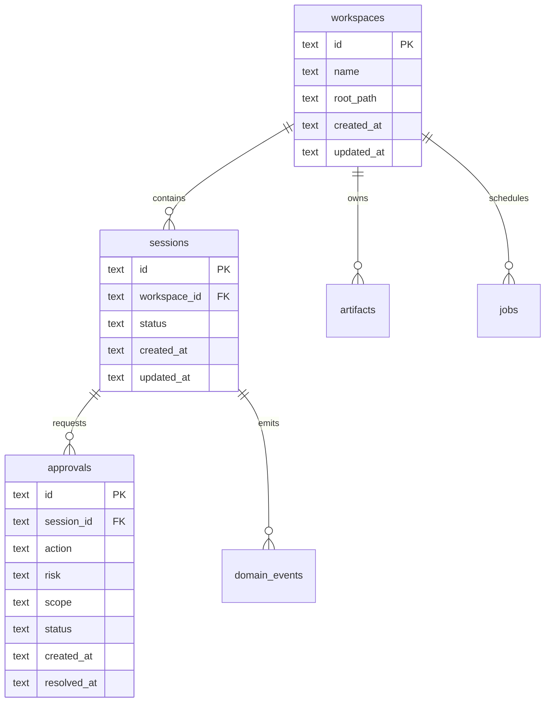

# معمارية التخزين وTyped IPC — الشريحة الأولى

## نطاق الشريحة

تضيف هذه الشريحة عقدًا قابلًا للتشغيل والاختبار لتخزين الحالة الأساسية ونقل الطلبات بين طبقة العرض والنواة. لا تضيف Electron بعد، ولا تفتح Node APIs إلى renderer، ولا تربط المشروع بمشغل SQLite native قبل اختيار adapter ومراجعة التراخيص والبناء.

## تصميم SQLite

يُحفظ كل domain state القابل للاستعادة في قاعدة محلية واحدة لكل profile، مع migrations مرتبة وغير قابلة لإعادة الكتابة. يستخدم SQLite في الشريحة الأولى كـ **schema contract** و`SqlExecutor` port؛ أما التنفيذ الأصلي فيُضاف لاحقًا خلف port دون تغيير Domain أو Application.



الجداول الأولى هي `schema_meta`, `workspaces`, `sessions`, `approvals`, `jobs`, `artifacts`, و`domain_events`. كل جدول يملك ID نصيًا مولدًا خارج SQL، وtimestamps ISO-8601، و`schema_version` حيث يلزم. لا تُخزن الأسرار أو prompts الكاملة أو tokens في هذه الجداول. يُستخدم `domain_events` كـ audit/outbox أولي مع `event_id` فريد و`correlation_id` وpayload JSON منقح.

## Migration rules

كل migration ملف SQL ثابت يبدأ برقم، ويُطبق داخل transaction، ويسجل اسمه وchecksum في `schema_meta`. لا تُعدّل migration منشورة؛ يضاف ملف جديد. التطبيق يفشل مغلقًا إذا كان migration checksum مختلفًا، ويعرض للمستخدم إجراء backup/repair بدل حذف القاعدة. recovery لا يكتب فوق النسخة الأصلية قبل نجاح validation.

## Typed IPC

```ts
type IpcRequest<M extends string, P> = {
  protocolVersion: 1;
  requestId: string;
  correlationId: string;
  method: M;
  payload: P;
};

type IpcResponse<T> = {
  protocolVersion: 1;
  requestId: string;
  ok: boolean;
  result?: T;
  error?: { code: string; message: string; retryable: boolean; userAction?: string };
};
```

الـ IPC surface الأولى هي `workspace.open`, `session.create`, `approval.request`, `approval.resolve`, `preview.create`, و`health.get`. كل method يملك payload وresult typed، ولا يقبل `any` أو arbitrary channel. الـ preload هو الحد الوحيد بين renderer وmain، ويطبق validation وsender check وcorrelation وredaction. الأحداث outbound هي `session.event`, `approval.required`, `preview.event`, `job.progress`, و`diagnostic.log`.

## حدود الأمان

الـ renderer لا يملك filesystem أو child process أو environment access. لا تُقبل request من sender غير معروف، ولا يُسمح بإعادة استخدام request ID، ولا تُرسل stack traces أو SQL أو secrets إلى UI في production. كل IPC call يسجل latency وresult code وcorrelation ID دون payload حساس. high-risk methods لا تُنفذ من IPC مباشرة قبل policy/approval.

## حدود الأداء والتعافي

عمليات القراءة القصيرة synchronous داخل adapter غير مقبولة في UI؛ التطبيق يستخدم async contract حتى لو كان in-memory. كل request يملك timeout وcancellation semantics. عند انقطاع main أو فشل migration، يعود renderer إلى `DEGRADED` ويعرض recovery action. لا تُنشأ transaction طويلة أثناء تشغيل agent أو preview.

## معايير القبول

تُقبل الشريحة عندما تكون migrations قابلة للتحليل، ويُرفض checksum mismatch، وتنتقل workspace/session/approval إلى storage port، وتُرفض IPC methods غير المعروفة أو payload غير الصحيح، وتعمل in-memory IPC adapter بنفس contracts، وتثبت الاختبارات correlation وredaction وtimeout semantics دون تشغيل Electron أو قاعدة native.

## قرارات مؤجلة

اختيار `better-sqlite3` أو `sqlite3` أو driver آخر، ومكان قاعدة profile، وFTS5 schema، وbackup encryption، وElectron preload implementation. هذه قرارات Infrastructure لا تُسرّب إلى Domain.

## References

[1]: ../docs/34-clean-architecture.md "Clean Architecture"
[2]: ../docs/35-domain-and-events.md "Domain and Event Model"
[3]: ../docs/17-security-model.md "Security Model"
[4]: https://www.electronjs.org/docs/latest/tutorial/process-model "Electron Process Model"

إعداد: Manus AI. تاريخ التنفيذ: 2026-08-22.
