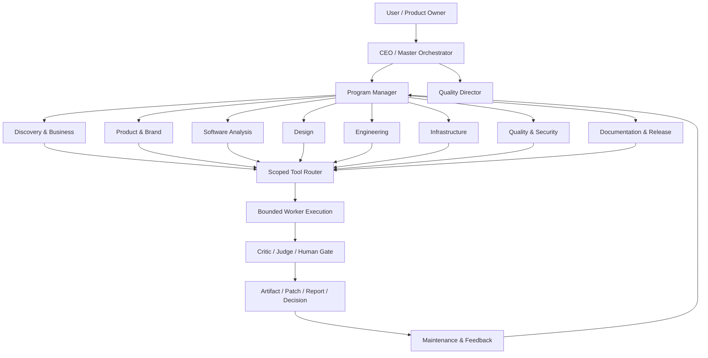

# معمارية منظمة الوكلاء وعقد Agent Definition

**الحالة:** قرار معماري موثق، غير منفذ كـAgent Registry أو orchestrator قابل للتشغيل.

## 1. الغرض والحدود

يحتاج Osamah Studio Agents إلى التمييز بين **تعريف الوكيل** و**جلسة تشغيله** و**الأداة** و**صلاحية الوصول** و**نطاق الذاكرة**. لا يعني تسجيل 46 دورًا تشغيل 46 process. يظل التطبيق Modular Desktop Monolith مع process isolation انتقائيًا، ويُشغّل worker واحدًا أو عددًا صغيرًا حسب low-memory profile.

هذه الوثيقة لا تمنح أي وكيل صلاحية تنفيذ، ولا تنشئ provider أو MCP أو browser access. هي schema ومعمارية انتقالية يجب تحويلها لاحقًا إلى port/contract/tests قبل أي runtime implementation.

## 2. الهيكل التنظيمي المقترح



| المستوى | الدور | السلطة | ما لا يفعله |
|---|---|---|---|
| القيادة | CEO/Master Orchestrator | يحدد workflow ويصعد التعارضات | لا ينفذ shell أو write مباشرة |
| الإدارة | Program Manager | يملك milestones/dependencies/ownership | لا يمنح permissions ذاتيًا |
| الجودة | Quality Director | يطلب evidence ويمنع delivery عند فشل gate | لا يغير النتيجة بدون evidence |
| التخصص | Discovery/Product/Engineering وغيرها | يقترح ناتجًا في نطاقه | لا يستدعي tool خارج capability |
| التنفيذ | Worker | ينفذ خطوة bounded بعد تفويض | لا يوسع scope أو يعيد التفويض بلا حد |
| التقييم | Critic/Judge | نقد ومقارنة بالقبول | لا يطبق patch أو ينشر |
| الإنسان | Human Gate | يوافق/يرفض الأفعال عالية المخاطر | لا يُختزل إلى approval مخفي |

## 3. عقد Agent Definition المقترح

قبل تنفيذ registry، يجب أن يحمل كل تعريف الحقول التالية. `schema_version` و`agent_id` و`role` و`status` مطلوبة، والحقول الأخرى لا يجوز أن تكون نصوصًا غامضة.

| الحقل | نوع/قيد مقترح | الغرض |
|---|---|---|
| `schemaVersion` | integer ثابت ومهاجر | versioning |
| `agentId` | ID bounded غير قابل للمسار | identity |
| `role` | enum من taxonomy | الدور والحدود |
| `mission` | نص bounded | النتيجة المقصودة |
| `responsibilities` | قائمة bounded | الأعمال المسموحة |
| `inputs` | typed references | مصادر الإدخال |
| `outputs` | typed artifacts/reports/decisions | شكل الناتج |
| `tools` | capability IDs فقط | الأدوات المطلوبة |
| `permissions` | policy references | ما يحتاجه من صلاحية |
| `knowledgeSources` | source IDs/URLs مصنفة | الأدلة المسموحة |
| `dependencies` | agent/capability IDs | ordering |
| `upstream`/`downstream` | agent IDs | handoff graph |
| `decisionAuthority` | enum `suggest`/`approve`/`apply` | فصل الاقتراح عن التنفيذ |
| `validationCriteria` | acceptance rules | gate |
| `failureHandling` | retry/cancel/escalate policy | recovery |
| `handoffProtocol` | typed packet schema | التواصل |
| `memoryRequirements` | scope/visibility/retention/providerAccess | privacy |
| `reportingRequirements` | report kind/evidence | traceability |
| `securityBoundaries` | explicit deny/allow | isolation |
| `humanApprovalRequirements` | action/risk rules | Human Gate |

### نموذج handoff bounded

```text
HandoffPacket {
  schemaVersion
  packetId
  sourceAgentId
  targetAgentId
  taskId
  goal
  constraints[]
  inputRefs[]
  outputRefs[]
  evidenceRefs[]
  assumptions[]
  unresolvedQuestions[]
  memoryScope
  risk
  approvalState
  expiresAt
}
```

لا يحمل packet transcript كاملًا أو raw secret أو token أو user file content بلا reference policy. يجب أن تكون `evidenceRefs` قابلة للفحص، وأن يتحول الغموض إلى `unresolvedQuestions` لا إلى FACT.

## 4. دورة التنفيذ

1. ينشئ المستخدم goal؛ يحدد Orchestrator scope وmode (`manual`, `assisted`, أو allowlisted `autonomous`).
2. يبني Program Manager DAG bounded بعد فحص dependencies وresource budget.
3. ينشئ Quality Director acceptance criteria وevidence requirements قبل التشغيل.
4. يمرر كل worker HandoffPacket محدودًا، ويستخدم Tool Router capability allowlist.
5. يعيد Worker result/evidence/assumptions/changedRefs/nextRecommendation.
6. يتحقق Validator من schema والحدود، ثم ينتقد Critic النتيجة.
7. يقارن Judge الناتج بالـacceptance؛ عند التعارض ينشئ Conflict بدل الدمج التلقائي.
8. يطلب Human Gate للأفعال الحساسة مثل write/delete/send/share/deploy/commit/push أو provider/tool calls.
9. يسجل checkpoint وaudit event، ثم يسلم artifact/report/patch preview أو يعيد المحاولة مرة واحدة ضمن budget.

## 5. إدارة الفشل والتعارض

الفشل لا يُخفى بعبارة نجاح عامة. لكل task حالات `created`, `planning`, `waiting_approval`, `running`, `paused`, `failed`, `completed`, و`cancelled_with_recovery`. يحمل كل retry `idempotencyKey`، ويوقف النظام retry عند تغير context أو تجاوز resource budget أو ظهور secret/policy violation.

عند تعديل عاملين للمورد نفسه ينشأ `Conflict` يحتوي resource refs وsource-of-truth وpriorities وdecisionRequiredBy. لا يملك Critic أو Worker صلاحية حل التعارض عبر overwrite. يعرض Workspace التعارض ويطلب قرارًا بشريًا أو من Orchestrator المسموح.

## 6. ربط الأدوار الـ46

التقسيم التفصيلي للأدوار ودرجة التغطية الفعلية محفوظ في [تقرير التدقيق الشامل](76-comprehensive-project-audit-2026-08-22.md). الوضع الحالي هو أن غالبية الأدوار `DOCUMENTED ONLY` أو `MISSING` كتعريفات قابلة للتشغيل؛ أما Planner/Critic/QA/Security/Performance وبعض الهندسة فلها خدمات bounded جزئية وليست Agent Registry كاملة.

## 7. معايير قبول هذه المعمارية

لا تُعتبر المعمارية منفذة إلا عند وجود `AgentDefinitionPort` وvalidator fail-closed وInMemoryAgentCatalog واختبارات schema/ownership/permissions/handoff/cycle detection، ثم wiring read-only إلى Workspace. لا يبدأ DAG executor أو parallel workers أو autonomous mode قبل قياس الموارد وHuman Gate.

## 8. قرارات مطلوبة

يجب أن يحدد المالك عدد الأدوار التي تدخل MVP، وهل CEO/PM/QD أدوار مستقلة أم policies داخل runtime، وما هو مستوى autonomy، ومن يملك decision authority، وهل agent definitions يكتبها المستخدم أم تأتي من built-in catalog. لا يجوز اختيار هذه النقاط تلقائيًا لأنها تغير الأمن والموارد وتجربة المنتج.

إعداد: Manus AI. القرار معماري؛ لا يعلن تنفيذ Agent Catalog أو Orchestrator.
